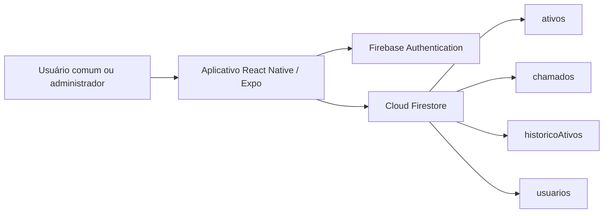

# Apoio para apresentação do TCC

## Problema

O controle manual de ativos de TI dificulta localizar equipamentos, acompanhar defeitos, prestar contas e manter um histórico confiável das intervenções.

## Objetivo

Centralizar inventário, rastreabilidade e manutenção de computadores, switches e computadores all-in-one Arquimedes em uma aplicação acessível para usuários e gestores.

## Arquitetura



## Casos de uso demonstráveis

1. Administrador cadastra um novo Arquimedes e marca a tela como danificada.
2. O equipamento recebe status de manutenção automaticamente.
3. Usuário comum abre um chamado pela Central de Chamados.
4. Gestor acompanha o chamado e os indicadores na Central de Chamados.
5. Administrador consulta a linha do tempo do ativo.
6. Gestor exporta o inventário em CSV para auditoria.
7. Administrador cadastra um novo usuário pela área administrativa.
8. Usuário redefine a senha pelo e-mail institucional.
9. Administrador remove um usuário comum sem apagar o histórico operacional.

## Modelo de dados

| Coleção | Finalidade |
| --- | --- |
| `ativos` | Patrimônio, tipo, setor, hardware, rede, tela e situação atual |
| `chamados` | Problema informado, ativo associado, responsável e andamento |
| `historicoAtivos` | Linha do tempo imutável das ações |
| `usuarios` | Perfil de acesso administrativo ou comum |

## Diferenciais

- QR Code para identificação física.
- Representação visual das portas do switch.
- Exportação CSV para prestação de contas.
- Regras de acesso por perfil.
- Bloqueio imediato de acessos removidos e proteção contra exclusão acidental de administradores.
- Histórico de auditoria.
- Tratamento próprio para computadores all-in-one Arquimedes.

## Testes

Execute:

```bash
npm test
npx tsc --noEmit
```

Os testes automatizados validam a classificação de equipamentos e a transição para manutenção quando uma tela ou componente apresenta defeito.
