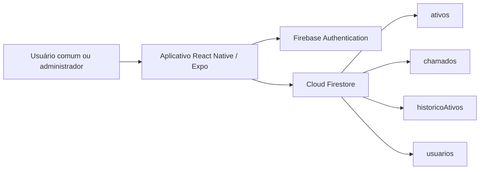

# Apoio para apresentação do TCC

## Problema

No setor de TI, o controle dos equipamentos ainda costuma depender muito de planilhas, anotações ou conferência manual. Isso acaba dificultando a localização dos ativos, o acompanhamento de defeitos, a prestação de contas e a consulta ao histórico de manutenção de cada equipamento.

Quando não existe um sistema centralizado, também fica mais difícil saber qual equipamento está em uso, qual está em manutenção, quem abriu determinado chamado e quais ações já foram realizadas pela equipe técnica.

## Objetivo

O objetivo do projeto é desenvolver uma aplicação para organizar o inventário e o acompanhamento dos ativos de TI, como computadores, switches e computadores all-in-one Arquimedes.

A ideia é reunir, em um único sistema, informações sobre patrimônio, setor, estado do equipamento, histórico de alterações e chamados de manutenção. Dessa forma, usuários, técnicos e gestores conseguem acessar as informações com mais facilidade e acompanhar melhor o ciclo de vida dos equipamentos.

## Arquitetura



A aplicação foi construída em React Native com Expo, usando Firebase para autenticação e banco de dados. O Firebase Authentication controla o acesso dos usuários, enquanto o Cloud Firestore armazena os dados dos ativos, chamados, histórico e usuários cadastrados.

## Casos de uso demonstráveis

Durante a apresentação, é possível demonstrar algumas situações práticas do sistema:

1. O administrador cadastra um novo computador Arquimedes.
2. Ao informar que a tela está danificada, o sistema altera o status do equipamento para manutenção.
3. Um usuário comum abre um chamado pela Central de Chamados.
4. O gestor acompanha os chamados abertos e visualiza os indicadores da central.
5. O administrador consulta a linha do tempo de um ativo para verificar alterações anteriores.
6. O gestor exporta o inventário em CSV para conferência ou auditoria.
7. O administrador cadastra um novo usuário pela área administrativa.
8. O usuário redefine a senha pelo e-mail institucional.
9. O administrador remove um usuário comum sem apagar o histórico das ações já realizadas.
10. O usuário comum acessa um portal simplificado, descreve o problema e abre um chamado sem precisar procurar o ativo manualmente.
11. Quando o usuário possui um equipamento vinculado, o sistema sugere automaticamente o patrimônio para a equipe técnica.
12. O gestor consegue acompanhar a prioridade do chamado, o técnico responsável e os horários de atendimento.

## Modelo de dados

| Coleção           | Finalidade                                                                                                  |
| ----------------- | ----------------------------------------------------------------------------------------------------------- |
| `ativos`          | Guarda as informações dos equipamentos, como patrimônio, tipo, setor, hardware, rede, tela e situação atual |
| `chamados`        | Registra os problemas informados pelos usuários, o ativo relacionado, o responsável e o andamento           |
| `historicoAtivos` | Armazena a linha do tempo das alterações feitas nos equipamentos                                            |
| `usuarios`        | Controla os perfis de acesso, separando usuários comuns e administradores                                   |

## Diferenciais do projeto

O sistema possui alguns recursos que ajudam a tornar o controle dos ativos mais organizado:

* Uso de QR Code para facilitar a identificação física dos equipamentos.
* Visualização das portas do switch, ajudando no controle da rede.
* Exportação do inventário em CSV para conferência e prestação de contas.
* Regras de acesso por perfil de usuário.
* Bloqueio de acessos removidos.
* Proteção contra exclusão acidental de administradores.
* Histórico de auditoria das ações realizadas.
* Tratamento específico para computadores all-in-one Arquimedes.
* Portal de autoatendimento para abertura de chamados.
* Registro da triagem dos chamados, com prioridade, responsável e horários.

## Testes

Para validar o funcionamento do projeto, foram utilizados testes automatizados e verificação de tipos.

Os comandos utilizados foram:

```bash
npm test
npx tsc --noEmit
```

Os testes verificam regras importantes do sistema, como a classificação dos equipamentos e a mudança automática para manutenção quando uma tela ou componente apresenta defeito.
